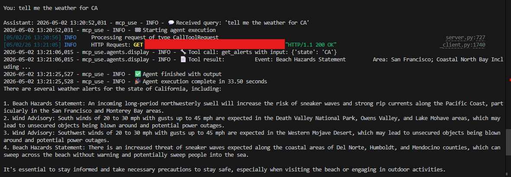

# Weather Agent

A comprehensive weather MCP server with US alerts and global weather data.

## Features
- **US Weather Alerts**: Get active weather alerts for any US state using NWS API (free, no API key needed).
- **Global Current Weather**: Get current weather for any city worldwide using wttr.in API (free, no API key needed).

## Setup

After cloning, run the following commands from the `weatheragent` folder:

```bash
git clone <repo-url>
cd mcp_server_weather_agent/weatheragent
uv sync
```

If `uv` is not installed, install it first:

```bash
python -m pip install uv
```

### OpenWeatherMap API key
The global weather tool uses OpenWeatherMap and requires a free API key.

Create a `.env` file in the `weatheragent` folder with:

```bash
OPENWEATHER_API_KEY=your_api_key_here
```

Alternatively, set the variable directly in your shell:

```bash
export OPENWEATHER_API_KEY=your_api_key_here
```

## Running

Start the weather chat client:

```bash
uv run server/client.py
```

This launches the interactive MCP chat client and connects to the weather server.

## Usage Examples
- "Get weather alerts for CA" (US state alerts)
- "What's the weather in Mumbai?" (global weather)
- "Weather in London" (global weather)

Both tools work simultaneously!

## Sample Output Screenshot

```md

```

